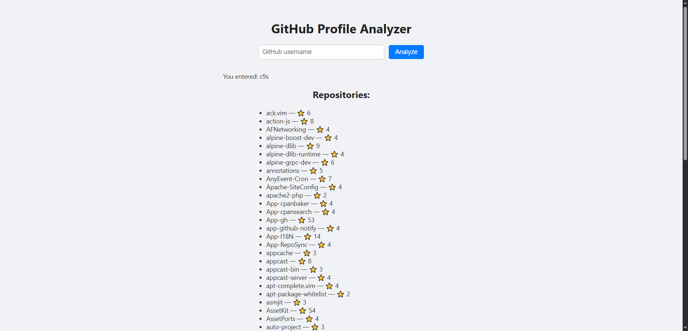
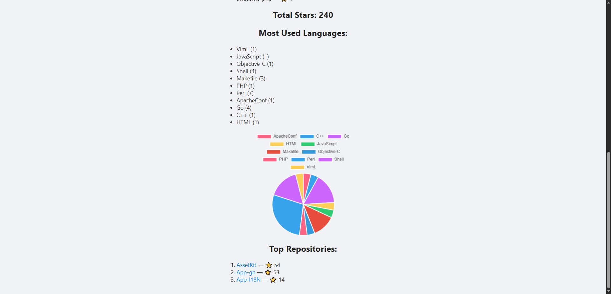

# GitHub Profile Analyzer 🧠📊

A simple Flask web app that analyzes a GitHub user's public profile and visualizes key data using charts.


## 🚀 Features

- Enter a GitHub username and instantly fetch:
  - Number of public repositories
  - Most-used programming languages
  - Number of stars across repos
- Clean chart-based visualization with Chart.js
- Lightweight and beginner-friendly Flask + HTML/CSS project

---

## 📸 Preview

<p align="center">
  
  
</p>

---

## 🧰 Tech Stack

- **Python 3**
- **Flask**
- **GitHub API**
- **Chart.js**
- HTML + CSS (and optionally Bootstrap)

---

## 🛠️ How to Run Locally

1. **Clone the repository**  
```bash
